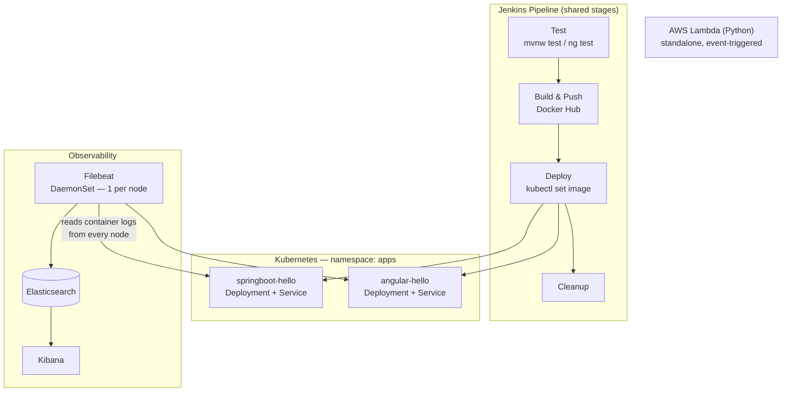

# Kubernetes Observability — ELK, Filebeat & CI/CD for Multi-App Deployments

> **FR** — Deux applications (Spring Boot, Angular) déployées sur Kubernetes via un pipeline Jenkins commun (tests, build, push, deploy, cleanup), avec centralisation des logs via une stack ELK et un DaemonSet Filebeat. Une fonction AWS Lambda (Python) illustre le compute serverless en complément du cluster.
>
> **EN** — Two applications (Spring Boot, Angular) deployed to Kubernetes through a shared Jenkins pipeline (test, build, push, deploy, cleanup), with centralized logging via an ELK stack and a Filebeat DaemonSet. An AWS Lambda function (Python) demonstrates serverless compute alongside the cluster.


---

## Problem

Once more than one application runs on a cluster, "SSH in and `tail` the logs" stops working — pods get rescheduled, restarted, and scaled, taking their local logs with them. And a CI/CD pipeline that only knows how to build one kind of application (say, a Java one) breaks the moment a second, structurally different application (a Node-based Angular frontend) joins the same deployment target. This project addresses both: a pipeline that treats two different tech stacks uniformly, and a logging layer that survives pods disappearing.

## Solution

A single parameterized Jenkins pipeline runs test → build → push → deploy → cleanup for both a Spring Boot API and an Angular frontend, reusing shared pipeline functions (`jenkins/pipeline.groovy`) parameterized by working directory and image name rather than duplicating stages per app. Logs from every pod in the `apps` namespace are collected by a **Filebeat DaemonSet** (one collector per node, not per pod) and shipped to **Elasticsearch**, visualized in **Kibana** — so a pod's logs remain queryable long after the pod itself is gone. A standalone **AWS Lambda** function demonstrates the serverless alternative to always-on cluster compute.

## Architecture



## Skills demonstrated

- Designing one CI/CD pipeline that's reused across structurally different applications (JVM + Node) via parameterization, instead of one pipeline per stack
- DaemonSet-based log collection: understanding why Filebeat runs one-per-node rather than as a sidecar per pod, and what that implies for node-level log access
- Running automated tests (`mvnw test`, `ng test`) as a real pipeline gate, with JUnit report publishing — not just build-and-ship
- Recognizing serverless (Lambda) as a distinct compute model worth knowing alongside container orchestration, not a replacement for it

## Key technical decisions

| Decision | Why |
|---|---|
| Shared Groovy pipeline functions, parameterized by directory/image name | Avoids a near-duplicate Jenkinsfile per application; adding a third app means calling the same functions with different arguments. |
| Filebeat as a DaemonSet, not a sidecar | One log collector per node reads every pod's logs on that node; a sidecar-per-pod would multiply the collector count for no benefit here. |
| Lambda kept as a standalone component | Serverless and cluster-based compute solve different problems; forcing Lambda's logic into the cluster would obscure that distinction. |

## Limitations

- No log retention/rotation policy configured on Elasticsearch — a real deployment would need an ILM (Index Lifecycle Management) policy.
- Filebeat ships logs but no alerting is configured in Kibana yet.
- Lambda is demonstrated standalone; it isn't wired into the same CI/CD pipeline as the two cluster applications.

## Roadmap

- [ ] Add an Elasticsearch ILM policy for log retention
- [ ] Add Kibana alerting rules on error-level log volume
- [ ] Extend the Jenkins pipeline to also package and deploy the Lambda function

---

## Prerequisites

- Docker Desktop, Minikube, `kubectl`
- AWS CLI (for the Lambda part)
- A Docker Hub account
- Jenkins (local or on a VM)

## Project Structure

```
.
├── Jenkinsfile                          # Shared pipeline: test → build → push → deploy → cleanup
├── jenkins/pipeline.groovy              # Reusable stage functions, parameterized per app
├── serverless/
│   └── lambda/
│       └── lambda_function.py           # AWS Lambda function (Python)
├── apps/
│   ├── hello_world/                     # Spring Boot REST API
│   │   ├── src/
│   │   ├── Dockerfile
│   │   ├── pom.xml
│   │   └── k8s/deployment.yaml
│   └── hello-angular/                   # Angular frontend
│       ├── src/
│       ├── Dockerfile
│       └── k8s/deployment.yaml
└── observability/
    ├── 00-namespace.yaml
    ├── 01-elasticsearch.yaml
    ├── 02-kibana.yaml
    └── 03-filebeat.yaml                 # Filebeat DaemonSet
```
